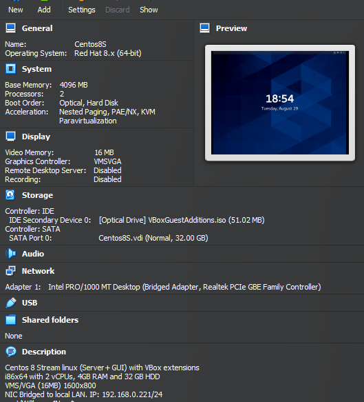
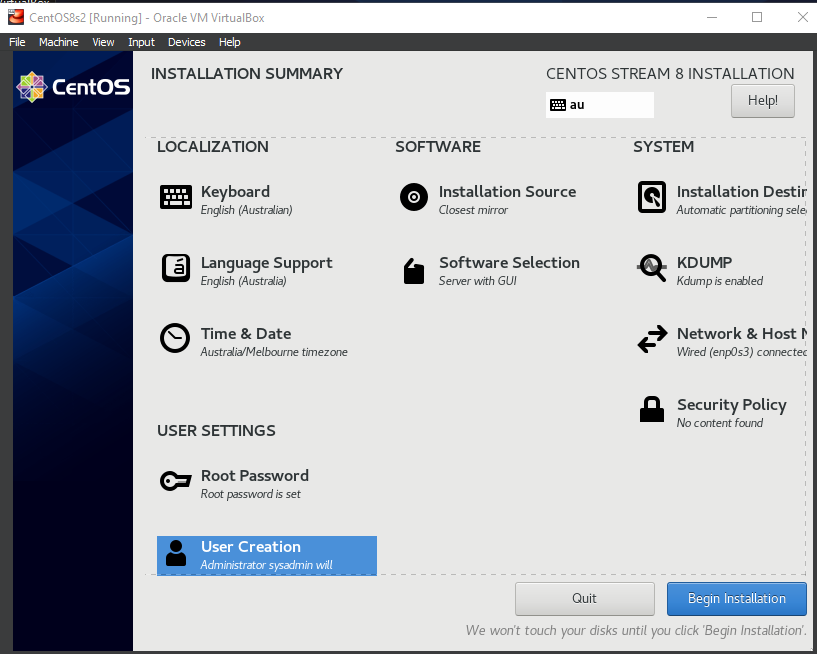
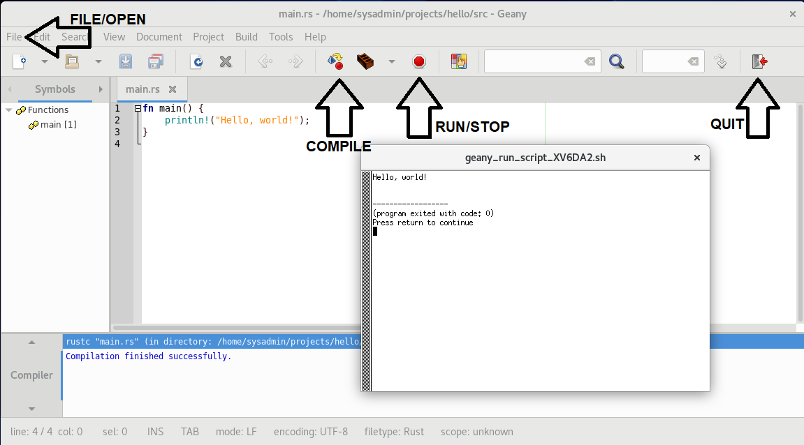

# 0-Setup
See [Project Prerequisites and Resources](https://liveproject.manning.com/module/1555_1_5/dynamic-programming-rust/introduction/prerequisites-and-resources?) for the official project specification.

This author chose to run the project in a local Linux Virtual Machine environment provided by [VirtualBOX](https://www.virtualbox.org) on a Windows 10 PC. This offered the advantages of: 
* concurrent dual screen visuals and panels with Cut-n-Paste features,
* independent access to the internet (especially GitHUB),
* local file storage, printing and applications in Windows,
* use of a MarkDown editor ([Obsidian](https://obsidian.md)) to prepare documents.

## Hardware setup
The host environment was a local desktop PC with:
* 16GB RAM
* 2TB HDD
* Dual LCD displays
* Fast FTTP internet access

## Software setup
The host PC was running Windows 10 with the following applications installed:
* Firefox v116.0.3 (64-bit) - Web browser - [Mozilla.org](https://www.mozilla.org/en-US/firefox/new)
* VirtualBOX v7.0.10 - Virtualisation environment - [Oracle Virtualbox](https://www.virtualbox.org)
* Obsidian - Windows-based markdown editor - [Obsidian.md](https://obsidian.md)
* Adobe Acrobat - PDF editor - [Acrobat](https://www.adobe.com/au/acrobat.html)

Licenses and Accounts required:
* Windows 10
* Obsidian *Catalyst* license
* Adobe *Creative Cloud* All Apps 100GB (Optional)*
*  GitHUB account

## Virtualisation of RUST in Linux
A CentOS 8 Stream environment with Rust was provided using VirtualBOX using the following steps:
1. Download a copy of the latest CentOS 8 Stream **boot.iso** CD image (compatible with your PC eg. AMD x86) from [CentOS 8 Stream Download](http://isoredirect.centos.org/centos/8-stream/isos/x86_64/) *950MB*
2. If not already present, install [VirtualBOX](https://www.virtualbox.org/wiki/Downloads) (latest version) with Extension pack.
3. Start VirtualBOX and create a new VM with the following specs.
   
	1. General:
		1. Name: *CentOS8s*
		2. OS: Red Hat 8.x (64-bit)
	2. System:
		1. Base memory: 4096MB
		2. Processors: 2
		3. Acceleration: Nested Paging, PAE/NX, KVM paravirtualization
	3. Storage
		1. Optical drive with CentOS Boot ISO loaded
		2. SATA port0 HDD: 32GB
	4. Network:
		1. Adapter 1: Bridged Adapter

_Creating VBox for Linux_

4. Start the new CentOS8s VM. It should boot from the attached CD image and start the CentOS Linux installer. When the installer boot selection appears, press the `UP ARROW` key to select the *Install* option and press `ENTER`.
5. After the Installer boot completes, in the `Welcome to CentOS Stream 8` screen, select `English (Australia)` and click **Continue**.
6. In the `Installation Summary` window click each location to complete the configuration as listed below. On each sub-screen, click the `Done` to commit the changed settings and return to the Summary screen:
	1. **Time & Date** - Select your timezone (eg *Australia/Melbourne*
	2. **Network & Hostname**
		1. Set the hostname to **centos8s.modem** (eg. if operating on a *Telstra* home network)
		2. Click `Configure` button and under the **General** tab, be sure that `Connect Automatically...` is ticked, then click `Save`
		3. Toggle the **Ethernet (enp0s3)** device to the `ON` state. After a short pause, the IP network configuration should be populated by DHCP... NOTE THE NETWORK ADDRESS GIVEN...
		4. Click `Done`
	3. ** System**
		1. Just click `Done` to adopt the default disk partitioning scheme.
	4. ** Software Selection**
		1. Choose **Server with GUI** in the *Base Environment* pane
		2. In the *Additional Software* pane, scroll down and tick **Guest Agents**, **Development Tools** and **Graphical Administration Tools**
		3. Click `Done`
	5. ** User Settings**  (May need to scrol down to see all options)
		1. Set the **Root Password**
		2. Visit the **User Creation** pane and enter a username (eg **sysadmin**) and a password. Also tick *Make this user administrator* to allow the **sudo** command...
		3. Click `Done`
7. Click the `Begin Install` button and come back in 15 minutes...
   
_CentOS Stream 8 Install_

8. After Installation completes, Click `Reboot System`, then login as administrator user (eg **sysadmin**) and assent to CentOS EULA.
9. Press the *Righthand-Ctrl* key to allow mouse activity in Windows, then click on the *Devices* tab in the VirtualBOX menu (at the top of the Console window) and select *Install Guest Additions CD image*. Click the button to "Run" the installation. When configuration of VirtualBOX Extensions is complete, logout and log back in again to refresh the system. Resize the screen as appropriate...
10. To allow *Drag-an-Drop* functions, go to the *devices* tab in the VirtualBOX menu (at the top of the Console window) and select  *Drag-and-Drop* - Bidirectional.
11. Open a **Firefox** browser and go to `https://www.rust-lang.org/tools/install`. Cut-and-Paste the `curl` command shown in the recommended install method. eg. `curl --proto '=https' --tlsv1.2 -sSf https://sh.rustup.rs | sh`
12. From the Linux desktop `Activities` menu, open a shell **Terminal** window and paste the `curl` command from above... Select option (1) to install the Rust toolset in the user `sysadmin` **HOME** environment. Enter `exit` to close the shell window, close the browser, then Logout and Log back in again to reinitialise...
13. Test that Rust is correctly installed for user `sysadmin`: Open a shell window and enter the following commands:
``` bash
rustc --version
cargo --version
mkdir projects
cargo new projects/hello
cd projects/hello
cargo run
```
14. Install a simple IDE called `geany`.
	1. From the Linux desktop *Activities* tab, open a shell Terminal window
	2. Install the *Extra Packaged for Enterprise Linux* using the command: `sudo dnf -y install epel-release`
	3. Once EPEL is installed, install `geany` using the command: `sudo dnf -y install geany xterm`
	4. In the *Activities* tab, clikc the 9-dot icon, then *right-click* the `geany` icon and select *Add to Favorites*. This will makeit easier to run `geany` directly from the *Activities* menu...
15. Test the `geany` IDE
	1. From the Linux desktop *Activities* tab start `geany` by clicking on the teapot/oil_lamp icon
	2. Click the **File** menu and choose **Open**
	3. Navigate to the file `/home/sysadmin/projects/hello/src` and select the file `main.rs`, then click the `open` button.
	4. Click the `Compile` button.
	5. Click the `run` button. This will open an `xterm` window and run the `hello` executable.
	   
	   _geany IDE environment_
	   
	6. Press `ENTER` in the **xterm** window, then click the `Quit` button to close **geany**


### (end)
